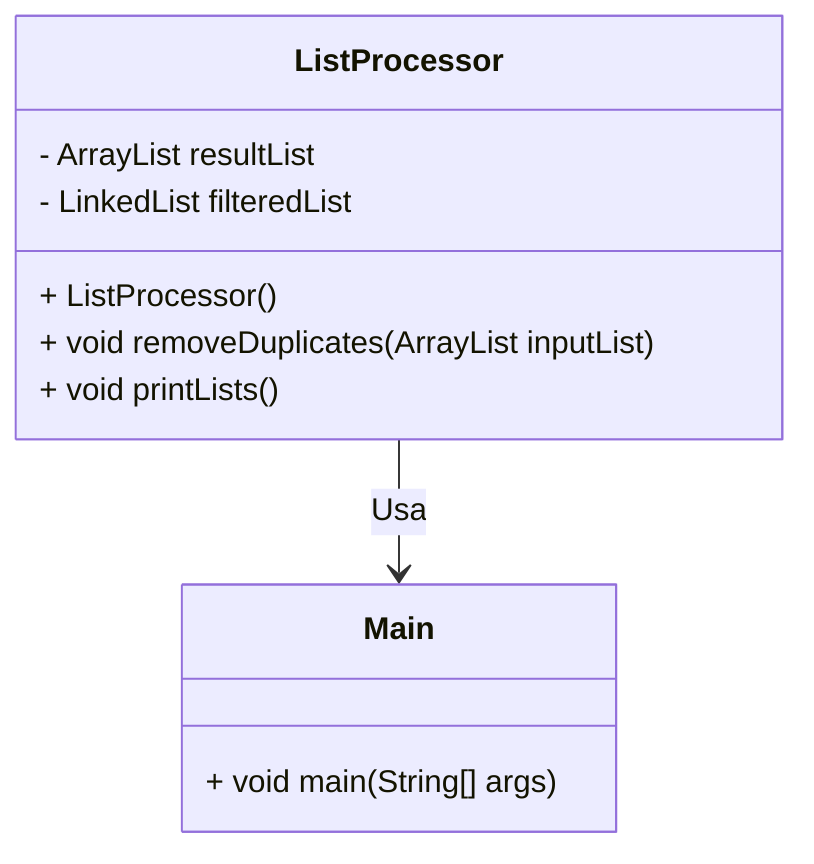
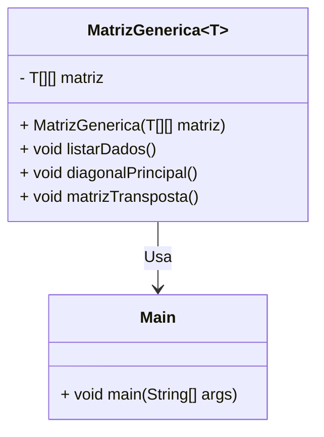

# Atividade 1: Implementando Listas em Java

## Descrição da Atividade

O objetivo desta atividade é implementar um programa em Java que utilize duas estruturas de dados: `ArrayList` e `LinkedList`. O programa deve processar uma lista de entrada, remover elementos duplicados e armazenar os valores únicos em uma `ArrayList` e os duplicados em uma `LinkedList`. Ao final, o programa deve exibir ambas as listas.

### Requisitos

1. Criar uma classe `ListProcessor` com os seguintes componentes:
    - Dois atributos:
        - `resultList`: Uma `ArrayList` para armazenar os elementos únicos.
        - `filteredList`: Uma `LinkedList` para armazenar os elementos duplicados.
    - Métodos:
        - `removeDuplicates`: Processa a lista de entrada, separando os elementos únicos e duplicados.
        - `printLists`: Exibe o conteúdo das duas listas.

2. Criar uma classe `Main` com o método `main` para testar a funcionalidade:
    - Criar exemplos de listas de entrada (números e letras).
    - Usar a classe `ListProcessor` para processar as listas.
    - Exibir os resultados.

### Exemplo de Entrada e Saída

| **Entrada**       | **Saída**                          |
|-------------------|------------------------------------|
| `1 2 3 3 4 4 5`   | Resultado (Lista 1): `1 2 3 4 5`   |
|                   | Filtrados (Lista 2): `3 4`         |
| `a b b f c v x`   | Resultado (Lista 1): `a b f c v x` |
|                   | Filtrados (Lista 2): `b`           |

---

## Diagrama de Classes



---

# Atividade #2 - Matriz Genérica

## Descrição da Atividade

### Contexto:
Implementação dos conceitos referentes a matrizes e genéricos.

### Objetivo:
Criar uma classe genérica que manipule uma matriz quadrada (NxN) de diferentes tipos de dados (Char, Int, Double, String) e implemente funcionalidades para listar os dados, exibir a diagonal principal e calcular a matriz transposta.

---

## Requisitos

1. **Classe Genérica:**
    - A classe deve ter como atributo uma matriz NxN que aceite os tipos: `Char`, `Int`, `Double`, `String`.

2. **Funcionalidades:**
    - **Listar dados:** Percorrer a matriz da esquerda para a direita e de cima para baixo, imprimindo uma linha da matriz por vez.
    - **Diagonal principal:** Imprimir todos os elementos da diagonal principal (onde linha = coluna).
    - **Matriz transposta:** Gerar e exibir a matriz transposta, transformando as linhas em colunas e vice-versa.

3. **Implementação:**
    - Pode ser utilizada `ArrayList` ou `LinkedList` para implementar a matriz.

---

## Exemplos de Entrada e Saída

### Exemplo 1: Matriz de Caracteres

#### Entrada:
```
a b c
d r f
g h i
```

#### Saída:
```
Matriz Original:
a b c
d r f
g h i

Diagonal Principal:
a r i

Matriz Transposta:
a d g
b r h
c f i
```

---

### Exemplo 2: Matriz de Inteiros

#### Entrada:
```
2 3 5
7 8 9
1 5 4
```

#### Saída:
```
Matriz Original:
2 3 5
7 8 9
1 5 4

Diagonal Principal:
2 8 4

Matriz Transposta:
2 7 1
3 8 5
5 9 4
```

---

## Diagrama de Classes




---

